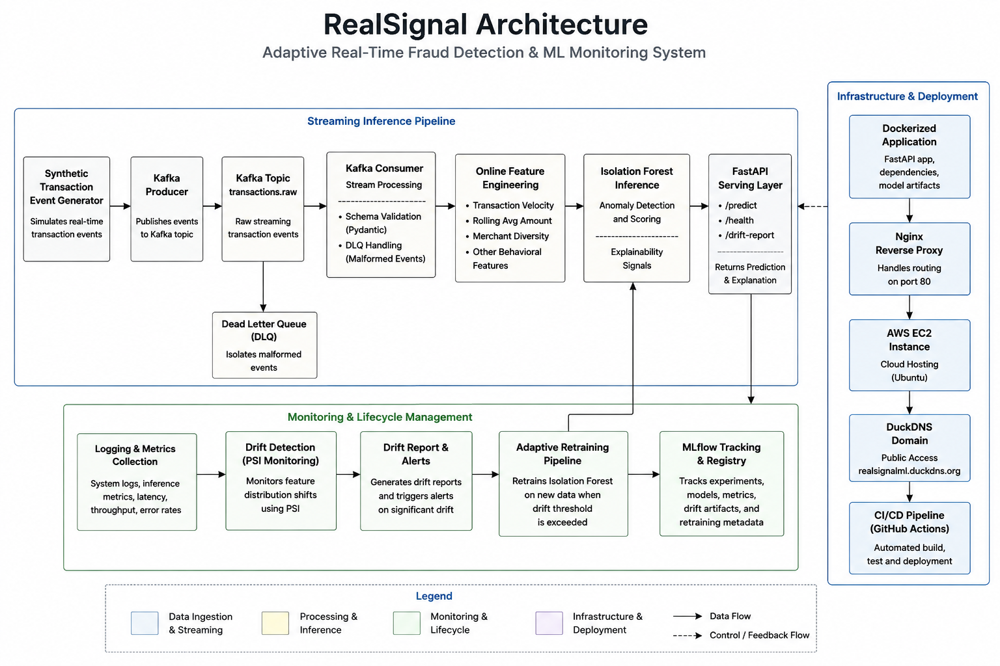
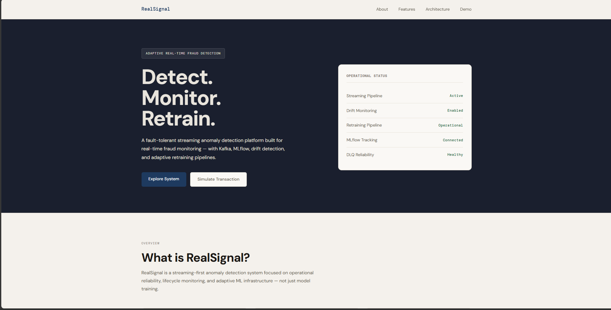
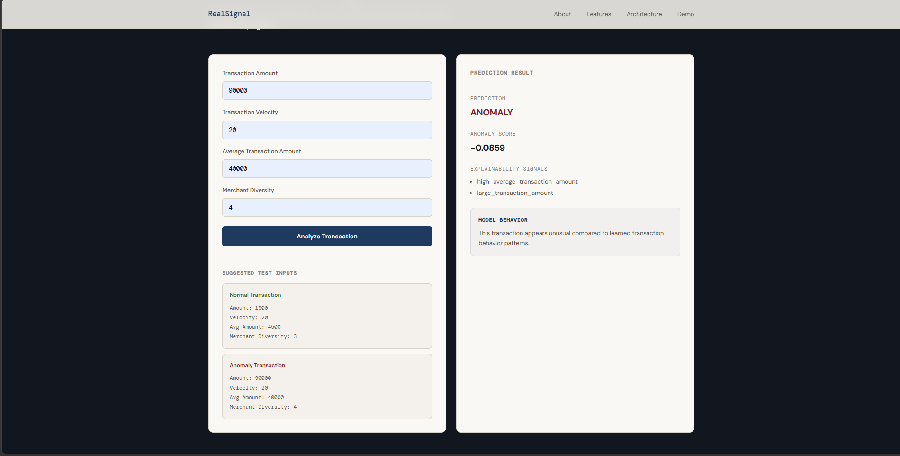
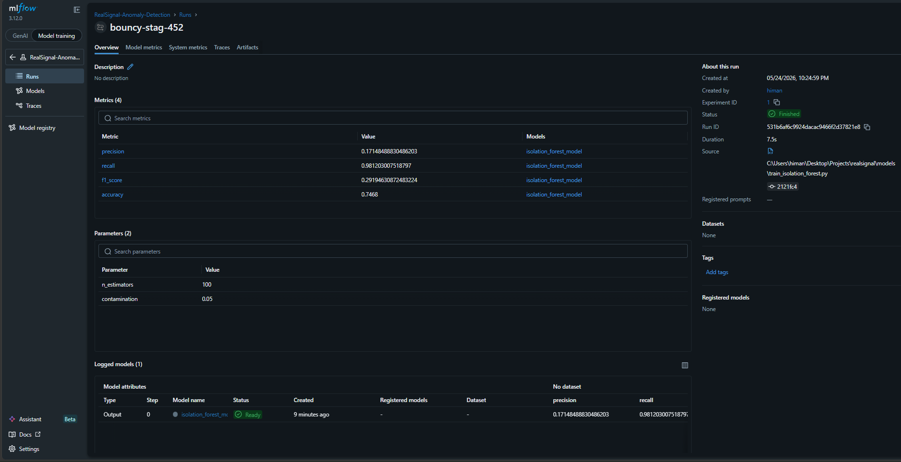

# RealSignal

**Adaptive Real-Time Fraud Detection & ML Monitoring System**

RealSignal is a streaming-first anomaly detection system built for real-time fraud monitoring, operational observability, and adaptive ML lifecycle management. The project simulates how production fraud monitoring infrastructure behaves in real-world ML systems environments.

## Live Demo

http://realsignalml.duckdns.org


## System Overview

RealSignal is a production-oriented ML systems project that simulates real-time fraud monitoring infrastructure using streaming inference, online feature engineering, anomaly detection, drift monitoring, and adaptive retraining workflows.

The system is designed to reflect operational ML behavior under continuously evolving transaction distributions rather than focusing purely on offline model evaluation.

Core system capabilities include:
- real-time streaming inference
- online behavioral feature engineering
- anomaly detection using Isolation Forest
- PSI-based drift monitoring
- adaptive retraining workflows
- ML lifecycle observability using MLflow
- containerized cloud deployment on AWS


## System Architecture




## Demo

Watch the video demo: [RealSignal Demo](https://youtu.be/zqPcyIgDgqU)

**Landing Page**


**Demo Section**


**MLflow Tracking**



## Key Operational Metrics

- Processed and monitored 5000+ streaming transaction events through Kafka-driven online feature engineering pipelines
- Reduced false positive anomaly predictions from 1261 to 36 through iterative feature distribution stabilization and contamination threshold refinement
- Implemented PSI-based drift monitoring across behavioral transaction features with adaptive retraining workflows
- Integrated MLflow lifecycle tracking for experiment logging, drift artifacts, and retraining observability


## Operational Capabilities

### Streaming Inference
Kafka-based producer-consumer pipeline for event-driven real-time transaction inference.

### Online Feature Engineering
Behavioral features computed dynamically during inference:
- transaction velocity
- rolling average transaction amount
- merchant diversity

### Anomaly Detection
Isolation Forest identifies statistically rare behavioral patterns using density-based anomaly isolation rather than rule-based fraud heuristics.

### Explainability Layer
Lightweight rule-based explainability signals provide operational reasoning without introducing high-latency attribution overhead.

### Drift Detection
Population Stability Index (PSI) monitors behavioral feature distribution shifts across streaming windows.

### Adaptive Retraining
Significant feature drift automatically triggers retraining workflows to maintain inference stability.

### MLflow Observability
MLflow tracks experiments, evaluation artifacts, drift reports, and retraining metadata.

### Fault Tolerance
Malformed streaming events are isolated through Dead Letter Queue (DLQ) handling to prevent consumer failures.


## Technology Stack

| Layer | Technology |
|---|---|
| Backend API | FastAPI |
| Streaming | Apache Kafka |
| ML Model | Isolation Forest |
| Experimental Evaluation | PyTorch AutoEncoder |
| Drift Monitoring | PSI |
| Experiment Tracking | MLflow |
| Frontend | HTML, CSS, JavaScript |
| Containerization | Docker |
| Reverse Proxy | Nginx |
| Cloud Deployment | AWS EC2 |
| CI/CD | GitHub Actions |
| Domain Routing | DuckDNS |
| Data Processing | Pandas |
| Model Persistence | Joblib |


## Deployment Architecture

RealSignal is deployed as a containerized inference service on AWS EC2 using Nginx reverse proxying for production-style request routing.

Deployment components:
- Docker containerized FastAPI inference server
- Nginx reverse proxy on port 80
- AWS EC2 cloud hosting
- DuckDNS domain routing
- GitHub Actions CI validation pipeline

Public Endpoint:
http://realsignalml.duckdns.org


## Project Structure

```
realsignal/
├── api/
│   └── metrics_api.py          # FastAPI endpoints
├── features/
│   └── online_features.py      # Runtime feature engineering
├── models/
│   ├── generate_dataset.py
│   ├── train_isolation_forest.py
│   ├── retrain_pipeline.py
│   └── inference.py
├── monitoring/
│   └── drift_detector.py       # PSI-based drift detection
├── services/
│   └── explainability_service.py
├── streaming/                  # Kafka producer/consumer
├── streaming_pipeline/
├── frontend/
│   ├── static/
│   └── templates/
├── dataset/
│   └── processed/
├── evaluation/
├── utils/
├── experiments/
│   └── autoencoder_comparison.ipynb
└── requirements.txt
```


## Setup & Running

### Prerequisites
- Python 3.9+
- Docker (for Kafka)
- pip

### Installation

```bash
git clone <repository-url>
cd realsignal

python -m venv venv

# Windows
venv\Scripts\activate

# Linux / Mac
source venv/bin/activate

pip install -r requirements.txt
```

### Start Kafka

```bash
docker-compose up
```

### Train the Model

```bash
# Generate synthetic dataset
python -m models.generate_dataset

# Train Isolation Forest
python -m models.train_isolation_forest \
  --train_data dataset/processed/transactions_dataset.csv \
  --eval_data dataset/processed/transactions_dataset.csv
```

### Start the API Server

```bash
uvicorn api.metrics_api:app --reload
```


## API Reference

### Health Check
```http
GET /health
```

### Drift Report
```http
GET /drift-report
```

### Predict Transaction
```http
POST /predict
Content-Type: application/json

{
    "amount": 1500,
    "velocity_1m": 20,
    "avg_amount_1m": 4500,
    "merchant_diversity_1m": 3
}
```

**Response:**
```json
{
    "prediction": "normal",
    "anomaly_score": -0.0842,
    "reasons": []
}
```


## Model Performance

| Metric | Value |
|---|---|
| Accuracy | 96% |
| Precision | 64% |
| Recall | 26% |
| F1 Score | 0.37 |

The system intentionally prioritizes high precision anomaly isolation over aggressive anomaly recall. In operational fraud monitoring systems, excessive false positives introduce analyst fatigue and reduce investigation efficiency.

Since RealSignal uses unsupervised anomaly detection without confirmed fraud labels, evaluation metrics should be interpreted as operational anomaly prioritization signals rather than traditional supervised classification performance.


## Design Decisions 

**Why Isolation Forest over supervised models?**
No labeled fraud data is available in most real-world deployments early on. Isolation Forest provides unsupervised anomaly detection based purely on behavioral density — it generalizes to novel fraud patterns rather than overfitting to known ones.

**Why rule-based explainability instead of SHAP?**
SHAP adds significant per-inference compute overhead. In a streaming system processing thousands of transactions per second, that latency is unacceptable. Rule-based signals are O(1) and interpretable enough for operational use.

**Why PSI for drift detection?**
PSI is well-understood in financial services, lightweight to compute, and interpretable without statistical background. It fits the streaming context better than more complex distribution tests.


## Architecture Evaluation

An experimental comparison between Isolation Forest and a lightweight PyTorch AutoEncoder was conducted to evaluate:
- inference latency
- operational complexity
- preprocessing overhead
- deployment suitability
- retraining maintainability

Although the AutoEncoder achieved lower raw inference latency in isolated benchmarks, Isolation Forest remained the preferred production choice due to lower operational complexity, simpler retraining workflows, and lightweight deployment requirements.

## CI/CD Pipeline

GitHub Actions validates:
- dependency installation
- import integrity
- model training workflows
- Docker image builds

This ensures deployment reproducibility and infrastructure consistency across environments.

## Production Deployment Challenges

The deployment process surfaced several operational issues commonly encountered in production ML systems:

- Docker container startup failures due to missing logging directories
- Model artifact persistence issues during containerized deployment
- Security group misconfigurations affecting external accessibility
- Reverse proxy configuration and public routing setup using Nginx

These deployment issues were intentionally resolved as part of the operationalization process rather than abstracted away.

## Known Limitations

- Transaction data is synthetically generated — real fraud distributions are noisier
- Feature space is intentionally small (3 behavioral signals)
- No ground truth fraud labels — evaluation is approximate
- Streaming simulation does not replicate true Kafka throughput at scale
- Retraining is triggered by drift, not by confirmed fraud signals

These are acknowledged tradeoffs, not oversights.


## License

This project is licensed under the MIT License. You are free to use, modify, and distribute this software with proper attribution.

See the [MIT License](LICENSE) file for full details.
